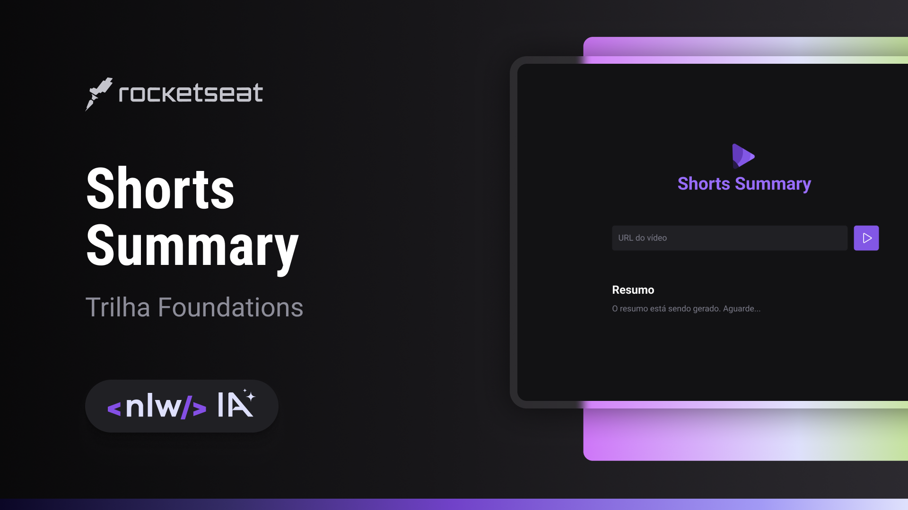

# Shorts Summary

Shorts Summary is a web application for creating summaries of YouTube shorts videos using Artificial Intelligence to transcribe the video content and generate a summary. This project is being developed in the Foundations track of the NLW IA edition.

# AI

- [Whisper](https://openai.com/research/whisper)
    ASR - Automatic speech Recognition
- [Bart](https://huggingface.co/docs/transformers/model_doc/bart)
    Summary

# Run locally

```console
$ npm install 
```

web

```console
$ npm run web
```

server
```console
$ npm run server
```

# Configuration

scripts

```
 "web": "vite",
 "server": "env YTDL_NO_UPDATE=1 node --watch --no-warnings server/index.js"
```

# Preview


